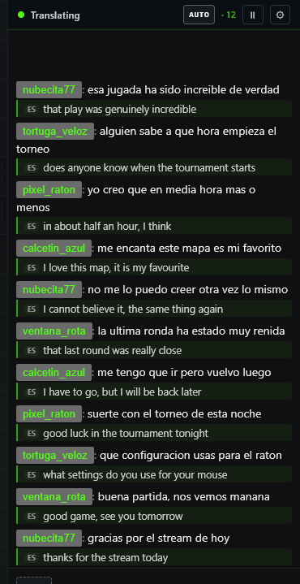
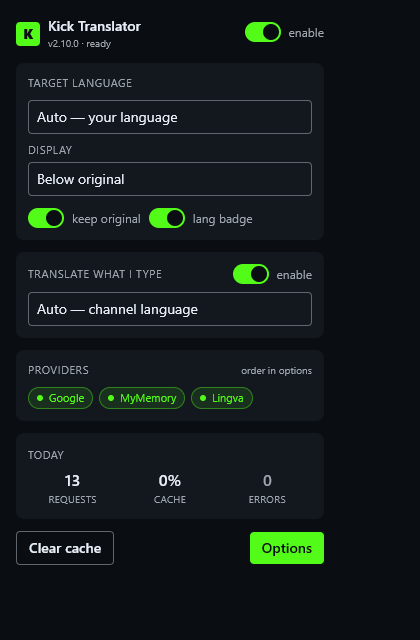
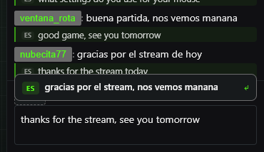
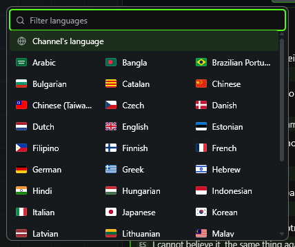

# Kick Chat Translator

[](https://github.com/Pkkls/kick-chat-translator/actions/workflows/ci.yml)
[](LICENSE)
[](https://github.com/Pkkls/kick-chat-translator/stargazers)
[](https://chromewebstore.google.com/detail/kick-chat-translator/nkkjmbkmacbdkboijmnhjnblcaiclhni)
[](https://chromewebstore.google.com/detail/kick-chat-translator/nkkjmbkmacbdkboijmnhjnblcaiclhni)
[](https://addons.mozilla.org/firefox/addon/kick-chat-translator/)

[English](README.md) · [日本語](README.ja.md) · [Português](README.pt-BR.md)

Traducción en tiempo real del chat de Kick.com, tanto en directos como en repeticiones de VOD. Abres un
stream y cualquier mensaje en otro idioma aparece traducido justo debajo. Sin nada que configurar.


Funciona en **Brave, Chrome, Edge y Firefox**, y entiende los emotes de 7TV.


**Cero configuración.** El chat entrante se traduce al idioma de *tu* navegador. Cuando escribes, una vista
previa muestra tu propio mensaje en el idioma *del canal* (detectado automáticamente desde Kick) justo encima
de la caja de chat; haz clic en ella o pulsa **Ctrl/Cmd+Enter** para enviar esa versión. Ambas direcciones
funcionan solas, así que nunca tienes que elegir un idioma. (Aun así puedes hacerlo, en los ajustes.)

**42 idiomas**, incluidos los de escritura de derecha a izquierda (árabe, hebreo, persa) y variantes
regionales (portugués de Brasil, chino tradicional).

---

| El chat, traducido mientras se desplaza | El popup de la barra |
|---|---|
|  |  |

| Lo que escribes, antes de enviarlo | Elige un idioma, o deja que lo elija |
|---|---|
|  |  |

<sub>Tomadas de la compilacion publicada por <code>scratchpad/harness/store-shots-fixture.mjs</code>, en una sala de chat que este repositorio inventa. Los nombres y los mensajes son inventados, las traducciones se responden localmente y nada sale de la maquina, asi que el nombre de ninguna persona real acaba en esta pagina.</sub>

## Novedades de la [2.8.1](https://github.com/Pkkls/kick-chat-translator/releases/latest)

**Las traducciones llegan cerca del doble de rapido.** Cada linea se retenia en una ventana de agrupacion
antes de enviarse, y esa ventana solo compensa si llega otra linea mientras esta abierta. Casi nunca
llegaba: medido en un canal en directo, veinticuatro de veintisiete envios salieron con un solo mensaje, y
la espera era de 186ms sobre una mediana de 217ms mientras la llamada de traduccion respondia en 43ms. La
mediana es de 111ms ahora, sin enviar peticiones adicionales, y nada cambia en un chat rapido, donde
agrupar si compensa.

## Novedades de la [2.8.0](https://github.com/Pkkls/kick-chat-translator/releases/tag/v2.8.0)

Una pasada por cada superficie que la extensión pone en pantalla: el chat, la barra encima, el popup y las
seis pestañas de ajustes. Algo es nuevo; la mayoría son cosas que estaban mal en silencio.

**Un botón de idioma, donde ya está tu mano.** Cambiar el idioma en el que escribes obligaba a subir a la
barra superior del chat y volver. Ahora el botón está en la propia barra de acciones del chat, justo antes
del engranaje, así que el puntero no sale del campo de texto. Un clic alterna entre el idioma del canal y tu
última elección, la flecha abre la lista completa y escribir dos letras la filtra. El primer idioma que
elijas queda como favorito; no hay nada que configurar.

**Las traducciones eran invisibles para algunos de vosotros, y lo eran desde hacía tiempo.** El texto
insertado seguía el ajuste claro u oscuro *del sistema operativo* en vez del chat donde vive. En un
escritorio claro leyendo un Kick oscuro, eso pintaba texto oscuro sobre el fondo oscuro de Kick: medido en
1,01:1 contra lo que tenía debajo, es decir, sin contraste alguno. Ahora lee el fondo real del chat y sigue
el cambio de tema de Kick sin recargar. Medido después: 10,98:1.

**"Reemplazar" reemplaza.** Era un cuarto ajuste de visualización que ningún control podía seleccionar, y
nombraba un estilo idéntico a "En línea" con el original todavía al lado. Ahora muestra 12 mensajes en
pantalla donde en línea muestra 9. "Al pasar el ratón" también dejó de escribir una etiqueta bajo cada
mensaje pasaras o no por encima, lo que costaba al chat un tercio de lo que podía mostrar. **Debajo sigue
siendo el estilo a usar; los otros tres están en desarrollo, y los ajustes lo dicen.**

**Todo habla tu idioma.** El chat, la barra y todos los menús de idiomas siguen el idioma de interfaz que
elegiste en la extensión, no el del navegador, en las diez interfaces. Treinta y nueve cadenas que estaban
en inglés eligieras lo que eligieras vienen ahora del catálogo, y los archivos de idioma pasaron de tres a
diez.

**Funciona sin ratón, y se refleja para el árabe.** La barra de pestañas de los ajustes era seis botones sin
relación para un lector de pantalla y costaba cinco pulsaciones cruzarla; ahora es una sola parada, con las
flechas, Inicio y Fin. Cada control tiene nombre, ninguno lo comparte, y ningún borde interactivo es ya
invisible. El chat, el popup y los ajustes se reflejan correctamente para lectura de derecha a izquierda.
Todo lo animado se detiene para quien se lo pide a su sistema, sin tocar las animaciones de Kick.

**Y las pequeñas cosas ruinosas.** Una URL larga o un muro de spam ya no empuja el chat de lado. Una línea
fallida ya no ocupa una fila entera, lo que importaba porque los fallos nunca llegan solos: con un proveedor
caído, el chat pasaba de 13 mensajes en pantalla a 8. El botón de reintento funciona con teclado y en
táctil, cuando antes solo respondía al ratón. La página de ajustes ya no se desplaza de lado en una ventana
estrecha.

Todo verificado con la extensión cargada en un navegador real sobre un canal real, que es como se descubrió
que el botón de idioma estaba anclado en el sitio equivocado.

Lista completa en [CHANGELOG.md](CHANGELOG.md).
---

## Instalación

**[➥ Chrome / Brave / Edge · Chrome Web Store](https://chromewebstore.google.com/detail/kick-chat-translator/nkkjmbkmacbdkboijmnhjnblcaiclhni)**
&nbsp;·&nbsp;
**[➥ Firefox · Mozilla Add-ons](https://addons.mozilla.org/firefox/addon/kick-chat-translator/)**

Un clic para instalar. Abre cualquier directo de Kick: una barra verde en la parte superior del chat indica que está funcionando.

<details>
<summary>O instala manualmente (descomprimida / build de desarrollo)</summary>

Descarga el zip correcto desde [Releases](https://github.com/Pkkls/kick-chat-translator/releases/latest) y descomprímelo.

- **Chrome / Brave / Edge** (`…-chromium.zip`): abre `chrome://extensions`, activa el **Modo de desarrollador**, pulsa **Cargar descomprimida** y selecciona la carpeta.
- **Firefox 121+** (`…-firefox.zip`): abre `about:debugging#/runtime/this-firefox`, pulsa **Cargar complemento temporal…** y selecciona el `manifest.json`.

</details>

## Motores de traducción

Cuatro proveedores en cadena: si uno falla, el siguiente toma el relevo.

| Proveedor | ¿Clave? | Nota |
|---|---|---|
| Google | No | Por defecto, funciona sin más |
| DeepL | Sí (gratis) | Mejor calidad. [Consigue una clave gratis](https://www.deepl.com/pro-api) (1M de caracteres/mes, 0 €) |
| MyMemory | No | Respaldo |
| Lingva | No | Respaldo. Usa una instancia pública de forma predeterminada; apunta a la tuya propia en los ajustes si lo prefieres |

El orden lo decides tú en los ajustes.

### Traducción en el dispositivo

El traductor integrado de Chromium, donde está disponible, es con diferencia la vía más rápida. Medido en
un canal en directo: **22 ms** desde que aparece un mensaje hasta que su traducción está en pantalla,
frente a **1618 ms** por la cadena en la nube. Sin red, sin límite, y el texto nunca sale de tu máquina.

Hay dos condiciones, y conviene conocer ambas antes de contar con ello.

La API tiene que existir. Firefox no la incluye. Chrome y Edge 138+ deberían, pero no está garantizado:
en la misma máquina, un Chrome 151 la exponía y otro no. Si el tuyo no la tiene, todo recae en la cadena
en la nube de arriba y nada se rompe.

Y el modelo de tu par de idiomas tiene que estar descargado, una vez, con un clic desde la barra. Hasta
entonces ese par también va a la nube, aunque los pares que ya descargaste sigan siendo locales.

## Ajustes

Haz clic en el engranaje de la barra del chat, o clic derecho en el icono de la extensión → Opciones.

- **Idioma de destino**: a qué idioma se traduce todo (42 disponibles)
- **Orden de proveedores**: arrastra para reordenar, pega tu clave de DeepL
- **Modo de motor**: primero en el dispositivo, primero en la nube, o solo en el dispositivo
- **Visualización**: cuatro estilos. Debajo del mensaje en su propia línea, en línea en una píldora después de él, en lugar del original dejando los emotes donde están, o solo al pasar el ratón. **Debajo es el que conviene usar por ahora; los otros tres siguen en desarrollo.** El texto original, el idioma de origen y el proveedor son insignias opcionales. Una línea de ejemplo en los ajustes muestra cada estilo antes de que elijas
- **Botón de idioma**: una ficha en la barra de acciones del chat, justo antes del engranaje. Un clic alterna entre el idioma del canal y tu última elección, mantener pulsado abre la lista y escribir dos letras la filtra. Está ahí para que cambiar el idioma en el que escribes nunca te obligue a subir al principio del chat
- **Vista previa al escribir**: activada o desactivada, su idioma de destino, y si al hacer clic se rellena la caja de chat o se copia la traducción al portapapeles
- **Filtros**: saltar bots, bloquear usuarios o canales, restringir los idiomas de origen, o permitir solo ciertos canales
- **Glosario**: pares de buscar y reemplazar aplicados a la traducción, para nombres y bromas internas que los motores destrozan
- **Presupuesto**: cuota de DeepL y enrutado inteligente, límite de frecuencia por canal, tamaño y duración de la caché, concurrencia
- **Pausa automática**: las pestañas en segundo plano dejan de traducir (ahorra tu cuota de DeepL)
- **Idioma de la interfaz** de la propia extensión, en inglés, español, francés, portugués, turco, ruso, árabe, chino, japonés o coreano, además de botones para vaciar la caché o restablecer estadísticas y ajustes
- **Depuración**: las últimas decisiones del traductor y por qué se dejó una línea sin traducir, guardadas solo en memoria

## Privacidad

Sin cuenta, sin analíticas, sin ningún servidor mío. Los mensajes van al proveedor de traducción que elegiste
y a ningún otro sitio; y en modo local, ni siquiera ahí. [Detalles](PRIVACY.md)

## FAQ

**P: La barra verde desapareció / la traducción dejó de funcionar.**
**R:** La 2.6.0 corrigió la causa: Kick deja en la página una segunda copia oculta del panel de chat, y la barra se montaba en esa copia, invisible desde el principio. Actualiza primero. Si sigue pasando en la 2.6.0 o posterior, recarga la página y abre una incidencia, porque entonces sería un fallo nuevo.

**P: Los mensajes no se están traduciendo.**
**R:** Abre los ajustes y asegúrate de que el idioma de destino sea distinto al de origen. Comprueba también que haya al menos un proveedor activo en la cadena.

**P: ¿Funciona en las repeticiones de VOD?**
**R:** Sí, la extensión traduce el chat tanto en directos como en repeticiones de VOD.

**P: ¿Qué navegadores son compatibles?**
**R:** Chrome, Brave, Edge y Firefox son todos compatibles.

**P: ¿Están seguros mis datos?**
**R:** No hay sistema de cuentas ni recopilación de analíticas. Los mensajes del chat se envían únicamente al proveedor de traducción que hayas elegido, y a ningún otro sitio.

**P: ¿Cómo consigo mejor calidad de traducción?**
**R:** Añade una clave de API gratuita de DeepL en los ajustes. El plan gratuito de DeepL cubre hasta 1 millón de caracteres al mes y supera de forma consistente a los proveedores por defecto.

**P: Algunos mensajes muestran caracteres extraños o no se traducen.**
**R:** Los mensajes muy cortos y los que contienen solo emotes se omiten a propósito: rara vez incluyen texto traducible y gastarían llamadas a la API en balde.

**P: La extensión se rompió tras una actualización de Kick.**
**R:** Kick a veces cambia la estructura de su chat, lo que puede romper la detección de mensajes. Abre un [issue en GitHub](https://github.com/Pkkls/kick-chat-translator/issues) y se corregirá lo antes posible.

## Idiomas soportados

Inglés · Francés · Español · Portugués · Portugués (Brasil) · Alemán · Italiano · Neerlandés · Polaco · Sueco · Checo · Eslovaco · Rumano · Ruso · Ucraniano · Turco · Árabe · Hebreo · Japonés · Coreano · Chino (simplificado) · Chino (tradicional) · Tailandés · Vietnamita · Indonesio · Hindi · Finés · Noruego · Danés · Griego · Húngaro · Búlgaro · Catalán · Esloveno · Estonio · Lituano · Letón · Persa · Bengalí · Tamil · Malayo · Filipino

## Cómo funciona

1. Un content script observa el DOM del chat de Kick y capta cada mensaje nuevo.
2. El mensaje pasa al service worker en segundo plano, que prueba los proveedores en orden hasta que uno funciona.
3. La traducción se inyecta de vuelta en el DOM, debajo del mensaje original.
4. Para los mensajes salientes, el idioma del canal se detecta automáticamente a través de la API de Kick y aparece una vista previa encima de la caja de chat.

La extensión nunca intercepta ni modifica las propias peticiones de red de Kick.

Pide `storage` y `alarms`, y acceso de host a kick.com, a cada proveedor de traducción al que puede llamar (Google, DeepL, MyMemory, las dos instancias de Lingva) y a `api.github.com`. Esto último es la comprobación de actualizaciones: lee la etiqueta de la última release, con límite de frecuencia y caché, y el popup ofrece un enlace cuando hay una versión más reciente. No se envía nada con esa petición y nada se actualiza solo.

---

## Compilar desde el código

```bash
git clone https://github.com/Pkkls/kick-chat-translator.git
cd kick-chat-translator
npm ci
npm run build     # salida en dist/
```

Otros comandos: `npm run dev` (HMR), `npm run test`, `npm run lint`,
`npm run pack` (zip para distribución).

Stack: MV3, Vite, TypeScript, Preact, Tailwind. El content script se distribuye
como un IIFE clásico para una inyección fiable en Brave.

## Licencia

MIT. Sin afiliación con Kick.

## Proyectos relacionados

- [kick-ad-blocker](https://github.com/Pkkls/kick-ad-blocker), bloquea los anuncios de Kick
- [kick-core](https://github.com/Pkkls/kick-core), el cliente de gateway en tiempo real que comparten estas extensiones
- [kickbus](https://github.com/Pkkls/kickbus), webhooks oficiales de Kick retransmitidos por SSE a bots locales
- [kick-drops-miner](https://github.com/Pkkls/kick-drops-miner), app de Windows que avanza el tiempo de visionado de los drops
