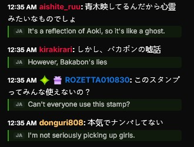

# Kick Chat Translator

[](https://github.com/Pkkls/kick-chat-translator/actions/workflows/ci.yml)
[](LICENSE)
[](https://github.com/Pkkls/kick-chat-translator/stargazers)
[](https://chromewebstore.google.com/detail/kick-chat-translator/nkkjmbkmacbdkboijmnhjnblcaiclhni)
[](https://chromewebstore.google.com/detail/kick-chat-translator/nkkjmbkmacbdkboijmnhjnblcaiclhni)
[](https://addons.mozilla.org/firefox/addon/kick-chat-translator/)

[English](README.md) · [Español](README.es.md) · [Português](README.pt-BR.md)

Kick.com のチャットをリアルタイムで翻訳します。ライブ配信でも VOD のアーカイブでも同じように動作します。
配信を開くと、外国語のメッセージの下に翻訳が表示されます。設定は不要です。


**Brave・Chrome・Edge・Firefox** で動作し、7TV のエモートにも対応しています。



**設定ゼロ。** 受信したチャットは*あなたのブラウザの*言語に翻訳されます。入力すると、あなたのメッセージを
*配信チャンネルの*言語（Kick から自動判定）に直したプレビューがチャット欄の上に表示されます。それをクリック
するか **Ctrl/Cmd+Enter** を押すと、その訳文を送信できます。どちらの方向も自動なので、言語を選ぶ必要は
ありません。（もちろん設定で選ぶこともできます。）

**42言語**に対応。右から左に書く言語（アラビア語・ヘブライ語・ペルシア語）や、地域変種
（ブラジルポルトガル語・繁体字中国語）も含みます。

---

## [2.8.1](https://github.com/Pkkls/kick-chat-translator/releases/latest) の新機能

**翻訳の表示がおよそ2倍速くなりました。** 各行は送信前にまとめ待ちの時間を挟んでいましたが、この待ち時間は
その間に別の行が届いて初めて割に合います。実際にはほとんど届いていませんでした。実配信での計測では、27回の
送信のうち24回が1件のみを運んでおり、中央値217msのうち186msがこの待ち時間で、翻訳呼び出し自体は43msで
応答していました。現在の中央値は111msで、追加のリクエストは発生しません。まとめが実際に効く高速なチャットでは
挙動は変わりません。

## [2.8.0](https://github.com/Pkkls/kick-chat-translator/releases/tag/v2.8.0) の新機能

画面に出るすべての面を見直しました。チャット、その上のバー、ポップアップ、設定の 6 タブ。新機能もあり
ますが、大半は静かに壊れていたものの修正です。

**言語ボタンを、手のある場所に。** 書く言語を切り替えるには、チャット上部のバーまで往復する必要があり
ました。ボタンはチャット自身の操作バー、歯車のすぐ手前にあるので、ポインタが入力欄から離れません。ク
リックでチャンネルの言語と直前に選んだ言語を切り替え、矢印で全一覧が開き、2 文字打てば絞り込めます。最
初に選んだ言語がそのままお気に入りになり、設定は不要です。

**一部の環境では、翻訳がずっと見えていませんでした。** 挿入したテキストが、置かれているチャットではな
く *OS* のライト / ダーク設定に従っていたためです。デスクトップがライトで Kick がダークだと、暗い背景に
暗い文字を描いていました。実測 1.01:1、つまりコントラストがまったくない状態です。現在はチャット自身の背
景を読み取り、Kick のテーマ切り替えにも再読み込みなしで追従します。修正後の実測は 10.98:1。

**「置き換え」が実際に置き換えます。** どの操作からも選べない 4 番目の表示設定で、名前に反して「インラ
イン」と同じ表示のまま原文も横に残していました。インラインが 9 件のところ 12 件表示します。「ホバー時」
も、実際にホバーしたかどうかに関わらず全メッセージの下にラベルを書くのをやめました。これがチャットの表
示件数を 3 分の 1 削っていました。**現時点では「下に表示」を使ってください。ほかの 3 つは調整中で、設定
画面にもそう書いてあります。**

**すべてがあなたの言語で。** チャット、バー、すべての言語メニューが、ブラウザではなく拡張機能で選んだ
言語で表示されます。10 言語すべてで対応しました。何を選んでも英語のままだった 39 個の文字列がカタログ
経由になり、同梱の言語ファイルは 3 言語から 10 言語になりました。

**マウスなしでも動き、アラビア語では左右が反転します。** 設定のタブバーはスクリーンリーダーには無関係
な 6 個のボタンで、横断に 5 回のタブが必要でした。現在は 1 ストップで、矢印・Home・End が使えます。すべ
ての操作要素に名前があり、重複はなく、見えない境界線もありません。チャット、ポップアップ、設定のいずれ
も右から左へ正しく反転します。動きを止めるよう OS に設定している人には、Kick 自身のアニメーションには触
れずに、こちらのアニメーションだけが止まります。

**そして、小さくて厄介なもの。** 長い URL やスパムの連続がチャットを横に押し出さなくなりました。失敗し
た行が 1 行を占有しなくなりました。これは重要で、障害は単独では起きません。プロバイダーが 1 つ落ちる
と、表示件数が 13 件から 8 件に落ちていました。再試行ボタンはキーボードとタッチで操作できます。以前はマ
ウスのホバーにしか反応しませんでした。設定画面も、狭いウィンドウで横スクロールしなくなりました。

すべて、実際のブラウザに拡張機能を読み込み、実際のチャンネルで確認しています。言語ボタンの取り付け位置
が間違っていたことも、それで分かりました。

全一覧は [CHANGELOG.md](CHANGELOG.md) にあります。
---

## インストール

**[➥ Chrome / Brave / Edge · Chrome Web Store](https://chromewebstore.google.com/detail/kick-chat-translator/nkkjmbkmacbdkboijmnhjnblcaiclhni)**
&nbsp;·&nbsp;
**[➥ Firefox · Mozilla Add-ons](https://addons.mozilla.org/firefox/addon/kick-chat-translator/)**

ワンクリックでインストール。Kick の配信を開いて、チャット上部に緑のバーが出れば動作中です。


<details>
<summary>手動でインストールする（展開済み / 開発ビルド）</summary>

[Releases](https://github.com/Pkkls/kick-chat-translator/releases/latest) から対応する zip をダウンロードして展開します。

- **Chrome / Brave / Edge**（`…-chromium.zip`）：`chrome://extensions` を開き、**デベロッパーモード**をオンにして、**パッケージ化されていない拡張機能を読み込む** からフォルダを選択します。
- **Firefox 121以上**（`…-firefox.zip`）：`about:debugging#/runtime/this-firefox` を開き、**一時的なアドオンを読み込む…** から `manifest.json` を選択します。

</details>

## 翻訳エンジン

4つのプロバイダーをチェーンで使います。1つが落ちたら次が引き継ぎます。

| プロバイダー | キー | 備考 |
|---|---|---|
| Google | 不要 | デフォルト、そのまま動く |
| DeepL | 必要（無料） | 品質最高。[無料キーを取得](https://www.deepl.com/pro-api)（月100万文字、0円） |
| MyMemory | 不要 | フォールバック |
| Lingva | 不要 | フォールバック。標準で公開インスタンスを使うので設定なしで動きます。好みで設定から自分のインスタンスを指定することもできます |

順番は設定で自由に変更できます。

### 端末内翻訳

Chromium 内蔵の翻訳機能は、使える環境ではほかより圧倒的に高速です。実際の配信チャットで計測した
ところ、メッセージが現れてから翻訳が画面に出るまで **22 ミリ秒**、クラウドのチェーン経由では
**1618 ミリ秒** でした。通信なし、上限なし、テキストが端末から出ることもありません。

ただし条件が2つあり、当てにする前に両方知っておく価値があります。

まず API 自体が存在すること。Firefox は搭載していません。Chrome と Edge は 138 以降で搭載している
はずですが、保証はありません。同じマシンで、ある Chrome 151 では使えて、別の Chrome 151 では使え
ませんでした。使えない場合は上のクラウドのチェーンに回るだけで、壊れることはありません。

そして言語ペアのモデルが一度ダウンロードされていること。バーから1クリックで済みます。それまでは
そのペアもクラウドに回りますが、ダウンロード済みのペアは端末内のままです。

## 設定

チャットバーの歯車、または拡張機能アイコンを右クリック → オプション。

- **翻訳先の言語**：すべてを何語に翻訳するか（42言語から選択）
- **プロバイダー順**：ドラッグで並べ替え、DeepL キーを貼り付け
- **エンジンモード**：端末内を優先、クラウドを優先、端末内のみ
- **表示**：4 つのスタイル。メッセージの下に別行で、同じ行にピル型で、原文と置き換えて（エモートはそのまま）、あるいはホバー時のみ。**現時点では「下に表示」を使ってください。ほかの 3 つはまだ調整中です。** 原文、翻訳元の言語、プロバイダーのバッジはそれぞれ任意。設定画面のサンプル行で、選ぶ前に各スタイルを確認できます
- **言語ボタン**: チャットの操作バー、歯車のすぐ手前にあるチップ。クリックでチャンネルの言語と直前に選んだ言語を切り替え、長押しで一覧を開き、2文字打てば絞り込めます。書く言語を変えるのにチャット上部まで戻らずに済むよう、この位置にあります
- **入力プレビュー**：オン/オフ、その翻訳先の言語、クリックしたときにチャット欄へ入れるかクリップボードにコピーするか
- **フィルター**：ボットを除外、ユーザー/チャンネルのブロック、翻訳元の言語を制限、特定のチャンネルのみ許可
- **用語集**：訳文に適用する置換ペア。エンジンが崩しがちな名前や内輪ネタ向け
- **予算**：DeepL の割り当てとスマートルーティング、チャンネルごとのレート制限、キャッシュのサイズと保持期間、同時実行数
- **自動一時停止**：バックグラウンドのタブは翻訳しない（DeepL の枠を節約）
- **インターフェースの言語**：拡張機能自体の表示を英語・スペイン語・フランス語・ポルトガル語・トルコ語・ロシア語・アラビア語・中国語・日本語・韓国語から選択。キャッシュの消去や、統計と設定のリセットのボタンもここにあります
- **デバッグ**：翻訳エンジンが直前に下した判断と、その行が翻訳されなかった理由。メモリ上にのみ保持されます

## プライバシー

アカウント不要、解析なし、こちらのサーバーもなし。メッセージは選んだ翻訳プロバイダーにしか送られず、
それ以外には一切送りません。端末内モードならそれすらしません。[詳細](PRIVACY.md)

## FAQ

**Q：緑のバーが消えた / 翻訳が止まった。**
**A：** 2.6.0 でこの原因を修正しました。Kick はページ内にチャットパネルの隠れた複製をもう1つ残しており、バーはそちらに取り付けられてしまい、最初から見えない状態になっていました。まず更新してください。2.6.0 以降でも起きる場合は、ページを再読み込みしたうえで issue を立ててください。それは新しい不具合です。

**Q：メッセージが翻訳されない。**
**A：** 設定を開き、翻訳先の言語が翻訳元と異なることを確認してください。また、チェーン内で少なくとも1つのプロバイダーが有効になっているかも確認してください。

**Q：VOD の録画再生でも動作しますか？**
**A：** はい、ライブ配信と VOD 再生の両方でチャットを翻訳します。

**Q：対応ブラウザは？**
**A：** Chrome、Brave、Edge、Firefox に対応しています。

**Q：データは安全ですか？**
**A：** アカウント機能はなく、分析データの収集もありません。チャットメッセージは選択した翻訳プロバイダーにのみ送信され、それ以外には送られません。

**Q：翻訳の精度を上げるには？**
**A：** 設定で無料の DeepL API キーを追加してください。DeepL の無料枠は月100万文字まで使え、デフォルトのプロバイダーより一貫して高品質です。

**Q：一部のメッセージに文字化けや未翻訳がある。**
**A：** 非常に短いメッセージやエモートだけのメッセージは意図的にスキップしています。翻訳できるテキストを含むことが少なく、API の無駄遣いになるためです。

**Q：Kick のアップデート後に拡張機能が動かなくなった。**
**A：** Kick がチャットの構造を変更することがあり、メッセージの検出が壊れる場合があります。[GitHub に Issue](https://github.com/Pkkls/kick-chat-translator/issues) を立てていただければ、できる限り早く修正します。

## 対応言語

英語 · フランス語 · スペイン語 · ポルトガル語 · ポルトガル語（ブラジル） · ドイツ語 · イタリア語 · オランダ語 · ポーランド語 · スウェーデン語 · チェコ語 · スロバキア語 · ルーマニア語 · ロシア語 · ウクライナ語 · トルコ語 · アラビア語 · ヘブライ語 · 日本語 · 韓国語 · 中国語（簡体字） · 中国語（繁体字） · タイ語 · ベトナム語 · インドネシア語 · ヒンディー語 · フィンランド語 · ノルウェー語 · デンマーク語 · ギリシャ語 · ハンガリー語 · ブルガリア語 · カタルーニャ語 · スロベニア語 · エストニア語 · リトアニア語 · ラトビア語 · ペルシア語 · ベンガル語 · タミル語 · マレー語 · フィリピン語

## 仕組み

1. content script が Kick のチャット DOM を監視し、新しいメッセージを捕捉します。
2. メッセージはバックグラウンドの service worker に渡され、いずれかが成功するまでプロバイダーを順番に試します。
3. 翻訳結果が元のメッセージの下に DOM へ挿入されます。
4. 送信メッセージについては、Kick の API を通じてチャンネルの言語を自動判定し、チャット入力欄の上にプレビューを表示します。

拡張機能は Kick 自身のネットワークリクエストを傍受も改変もしません。

要求するのは `storage` と `alarms`、そして kick.com、呼び出しうる各翻訳プロバイダ（Google、DeepL、MyMemory、2 つの Lingva インスタンス）、および `api.github.com` へのホストアクセスです。最後のものは更新確認で、最新リリースのタグを間隔を空けてキャッシュ付きで読み、新しい版があればポップアップにリンクを出すだけです。何も送信せず、自動更新もしません。

---

## ソースからビルド

```bash
git clone https://github.com/Pkkls/kick-chat-translator.git
cd kick-chat-translator
npm ci
npm run build     # 出力は dist/
```

その他のコマンド：`npm run dev`（HMR）、`npm run test`、`npm run lint`、
`npm run pack`（配布用 zip）。

スタック：MV3、Vite、TypeScript、Preact、Tailwind。content script は
Brave で確実に注入できるよう、クラシックな IIFE として配布されます。

## ライセンス

MIT。Kick とは無関係です。

## 関連プロジェクト

- [kick-ad-blocker](https://github.com/Pkkls/kick-ad-blocker)は Kick の広告をブロックする拡張機能
- [kick-core](https://github.com/Pkkls/kick-core)はこれらの拡張機能が共有するリアルタイム gateway クライアント
- [kickbus](https://github.com/Pkkls/kickbus)は Kick の公式 webhook をローカルの bot に SSE で中継
- [kick-drops-miner](https://github.com/Pkkls/kick-drops-miner)は Kick の drop 視聴時間を進める Windows アプリ
