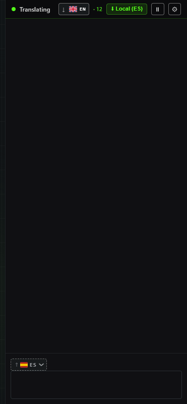
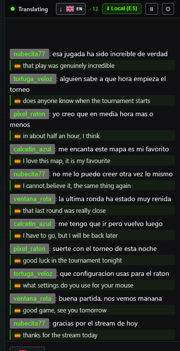
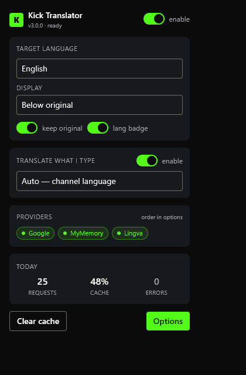
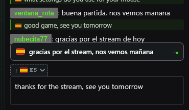
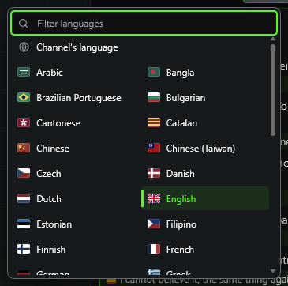

<div align="center">


# Kick Chat Translator

Kick のチャットをリアルタイム翻訳。どの配信のチャットも自分の言語で読み、チャンネルの言語で返信できます。

[](https://chromewebstore.google.com/detail/kick-chat-translator/nkkjmbkmacbdkboijmnhjnblcaiclhni)
[](https://chromewebstore.google.com/detail/kick-chat-translator/nkkjmbkmacbdkboijmnhjnblcaiclhni)
[](https://addons.mozilla.org/firefox/addon/kick-chat-translator/)
[](https://github.com/Pkkls/kick-chat-translator/actions/workflows/ci.yml)
[](LICENSE)

[English](README.md) · [Español](README.es.md) · [Français](README.fr.md) · [Português](README.pt-BR.md) · [Türkçe](README.tr.md) · [Русский](README.ru.md) · [العربية](README.ar.md) · [한국어](README.ko.md) · [中文](README.zh-CN.md) · [Čeština](README.cs.md)



[実際のチャットで動いている様子を見る](https://www.youtube.com/watch?v=NoGJeUrwy9o)

</div>

## できること

読めない言語でチャットが流れている Kick の配信を開いてください。メッセージが届くたびに、そのすぐ下に訳が表示されます。ライブ配信でも VOD のアーカイブでも同じです。返信を入力すると、チャット欄の上にチャンネルの言語でプレビューが表示されます。Tab を押すかプレビューをクリックすると、入力した文がその訳に置き換わります。

設定は要りません。届くチャットはブラウザの言語に訳され、あなたが書く文は Kick から読み取ったチャンネルの配信言語で送られます。どちらも設定で変更できます。

- 43 言語。右から左に書く言語（アラビア語、ヘブライ語、ペルシア語）と地域の変種（ブラジル・ポルトガル語、繁体字中国語、広東語）も含みます
- Google は鍵もアカウントも不要ですぐに使えます。品質を上げるなら自分の無料 DeepL キーを。MyMemory と Lingva が予備です
- ブラウザが提供する場合、Chrome と Edge では端末内で翻訳します。1.6 秒かかるところが 22 ms になり、テキストはマシンの外に出ません
- 7TV のエモート、ボットとユーザーのフィルター、キーワードフィルター、エンジンが崩す名前のための用語集
- チャットバーから一つのチャンネルだけを一時停止でき、ほかのチャンネルは止まりません。チャンネルを
  切り替えても、拡張機能を更新しても、開いているタブは再読み込みなしで翻訳を続けます
- Chrome、Brave、Edge、Firefox

| 流れるチャットをそのまま翻訳 | ツールバーのポップアップ |
|---|---|
|  |  |

| 送信する前の入力文 | 言語を選ぶ、または任せる |
|---|---|
|  |  |

<sub>このリポジトリが作った架空のチャットルームで、公開中のビルドから撮影しています。ユーザー名とメッセージは架空で、翻訳はローカルで返しているため、実在の人のハンドルはこのページに載りません。</sub>

## インストール

[Chrome、Brave、Edge: Chrome ウェブストア](https://chromewebstore.google.com/detail/kick-chat-translator/nkkjmbkmacbdkboijmnhjnblcaiclhni)
&nbsp;·&nbsp;
[Firefox: Mozilla Add-ons](https://addons.mozilla.org/firefox/addon/kick-chat-translator/)

Kick の配信を開くと、チャット上部の緑のバーが動作中であることを示します。ストア版は自動で更新されます。

<details>
<summary>リリースの zip から手動でインストール</summary>

[Releases](https://github.com/Pkkls/kick-chat-translator/releases/latest) からブラウザに合った zip をダウンロードして展開します。

- Chrome、Brave、Edge（`…-chromium.zip`）: `chrome://extensions` を開き、デベロッパーモードをオンにして「パッケージ化されていない拡張機能を読み込む」からフォルダを選びます。
- Firefox 121 以降（`…-firefox.zip`）: `about:debugging#/runtime/this-firefox` を開き、「一時的なアドオンを読み込む」から `manifest.json` を選びます。

この方法で入れたものは自動更新されません。新しいバージョンがあるとアイコンにバッジが付き、ポップアップからストアに移動できます。

</details>

## 翻訳エンジン

四つのプロバイダーをつないでいます。一つが失敗すると次が引き継ぎます。順番は自分で決められます。

| プロバイダー | キー | 備考 |
|---|---|---|
| Google | 不要 | 既定、すぐに使えます |
| DeepL | 無料 | 最高品質、[無料キー](https://www.deepl.com/pro-api)で月 100 万文字 |
| MyMemory | 不要 | 予備 |
| Lingva | 不要 | 予備、自分のインスタンスを指定しない限り公開インスタンス |

Chromium 内蔵の翻訳機はどれよりも速く動きます。ライブ配信で計測すると、メッセージが現れてから訳が画面に出るまで 22 ms、クラウド経由では 1618 ms でした。ネットワークもクォータも使いません。Chrome と Edge 138 以降で使える場合がありますが、すべての環境で使えるわけではなく、言語ペアごとにバーからワンクリックでモデルを一度ダウンロードする必要があります。Firefox にはありません。使えない環境ではクラウドが引き継ぎ、何も壊れません。

## 設定

チャットのバーの歯車をクリックするか、拡張機能のアイコンを右クリックして「オプション」を選びます。

- 翻訳先の言語。オンにすればチャンネルごとに読む言語を記憶します
- プロバイダーの順番、DeepL キー、エンジンのモード（端末内を優先、クラウドを優先、端末内のみ）
- 表示: メッセージの下（推奨）、メッセージのあとに同じ行で、原文と置き換え、ホバー時のみ。原文と翻訳元言語のバッジは任意
- チャットのアクションバーにある言語ボタン: クリックでチャンネルの言語と直前の選択を切り替え、長押しで一覧、二文字入力で絞り込み
- 入力プレビュー: オンかオフ、翻訳先の言語、クリックでチャット欄に入れるかコピーするか
- フィルター: ボットを飛ばす、ユーザー・チャンネル・キーワードをブロック、翻訳元の言語を限定
- 用語集: 訳文に適用する検索と置換の組
- 予算: DeepL のクォータ配分、チャンネルごとの上限、キャッシュのサイズと期限
- 読みやすさと外観: 文字サイズ、行間、書体、アクセントカラー、チャットのテーマ
- キーボード: Alt+T でチャット翻訳、Alt+W で入力プレビューをオン・オフ
- アクティビティ: 翻訳したメッセージ数、キャッシュのヒット、チャットで見かけた全言語、直近 50 行それぞれを訳した理由と訳さなかった理由
- 拡張機能自体の表示言語: 英語、スペイン語、フランス語、ポルトガル語、トルコ語、ロシア語、アラビア語、中国語、日本語、韓国語

## 対応言語

英語 · フランス語 · スペイン語 · ポルトガル語 · ポルトガル語（ブラジル） · ドイツ語 · イタリア語 · オランダ語 · ポーランド語 · スウェーデン語 · チェコ語 · スロバキア語 · ルーマニア語 · ロシア語 · ウクライナ語 · トルコ語 · アラビア語 · ヘブライ語 · 日本語 · 韓国語 · 中国語（簡体字） · 中国語（繁体字） · タイ語 · ベトナム語 · インドネシア語 · ヒンディー語 · フィンランド語 · ノルウェー語 · デンマーク語 · ギリシャ語 · ハンガリー語 · ブルガリア語 · カタルーニャ語 · スロベニア語 · エストニア語 · リトアニア語 · ラトビア語 · ペルシア語 · ベンガル語 · タミル語 · マレー語 · フィリピン語 · 広東語

## プライバシー

アカウントなし、アクセス解析なし、私のサーバーもありません。チャットのメッセージは選んだ翻訳プロバイダーにだけ送られ、端末内モードではそこにも送られません。ストアから入れた拡張機能はほかに何も通信しません。手動で入れたものは、更新バッジを出すかどうかを知るために、最長で六時間に一度 GitHub に最新リリースのタグを問い合わせます。[詳細](PRIVACY.md)

## よくある質問

**メッセージが翻訳されない。**
設定のアクティビティタブで「決定を読む」を押してください。直近 50 行と、それぞれを訳した理由、訳さなかった理由が表示されます。飛ばされた行のほとんどは意図的です。あるライブ配信では、飛ばされた 234 行のうち 213 行が同じユーザーの繰り返し、9 行が短すぎ、7 行が絵文字や笑いだけ、1 行がすでに読む言語でした。タブに何も表示されない場合は拡張機能がチャットを見つけられていないので、issue を開いてください。

**緑のバーが消えた。**
ページを再読み込みしてください。また起きたら、チャンネルとその前にしたことを添えて [issue](https://github.com/Pkkls/kick-chat-translator/issues) を開いてください。

**翻訳の質を上げるには？**
設定で無料の DeepL キーを追加してください。無料枠は月 100 万文字で、DeepL は無料エンジンより良くなる言語ペアにだけ使われます。

**どの表示スタイルを使えばいい？**
メッセージの下です。ほかの三つも動きますが、まだ調整中です。

**VOD のアーカイブでも動く？**
はい、ライブ配信と同じように動きます。

**Kick の更新のあとで動かなくなった。**
Kick はときどきチャットの構造を変えます。[issue](https://github.com/Pkkls/kick-chat-translator/issues) を開いてもらえれば修正します。

**Kick の公式？**
いいえ。Kick とは関係のない、独立したオープンソースのプロジェクトです。

## 新機能

各リリースの変更点とその裏付けの計測は
[Releases](https://github.com/Pkkls/kick-chat-translator/releases) と [CHANGELOG.md](CHANGELOG.md) にあります。

## 開発

```bash
git clone https://github.com/Pkkls/kick-chat-translator.git
cd kick-chat-translator
npm ci
npm run release:check    # 型チェック、lint、ユニットテスト、ビルド: どのパッケージも通るチェック
npm run build:firefox    # Firefox 用ビルド、同じ dist/ フォルダ
npm run package:all      # 二つの zip を release/ に
npm run dev              # HMR
```

ビルドは再現可能です。同じコミットからはどのマシンでもバイト単位で同一の zip ができます。タグの `git archive` を空のフォルダでビルドしてハッシュを比べて確認しています。

ユニットテストのほかに、ネットワークを使わない 41 のゲートがあります。ビルドした拡張機能を実際のブラウザに読み込んで操作し、その動作を検証します。ページも翻訳エンジンもローカルで応答します。Playwright が必要ですが、意図的に依存関係には入れていません。`UX_KIT` を Playwright の入った `node_modules` を持つフォルダに向けるか、`npm i -D playwright` を実行してください。

```bash
node test/e2e/run-gates.mjs --headless                  # 41 すべて、ウィンドウなし
node test/e2e/store-shots-fixture.mjs --lang=ja         # ストアのスクリーンショットを一つの掲載言語で
node test/e2e/store-shots-fixture.mjs --gif             # 英語のスクリーンショット、README の画像、この GIF
```

構成: Manifest V3、Vite、TypeScript、Preact、Tailwind。ストアの文面は [store/](store/) にあります。リリースはバージョンのタグで、CI がビルド、検証し、両方のストアに公開します。

## 関連プロジェクト

- [kick-ad-blocker](https://github.com/Pkkls/kick-ad-blocker): Kick のプレロール広告とオーバーレイ広告をブロック
- [kick-core](https://github.com/Pkkls/kick-core): これらの拡張機能が共有するリアルタイムゲートウェイのクライアント
- [kickbus](https://github.com/Pkkls/kickbus): Kick の公式 webhook を SSE でローカルのボットに中継
- [kick-drops-miner](https://github.com/Pkkls/kick-drops-miner): Kick のドロップの視聴時間を進める Windows アプリ

## ライセンス

MIT。Kick とは関係ありません。
